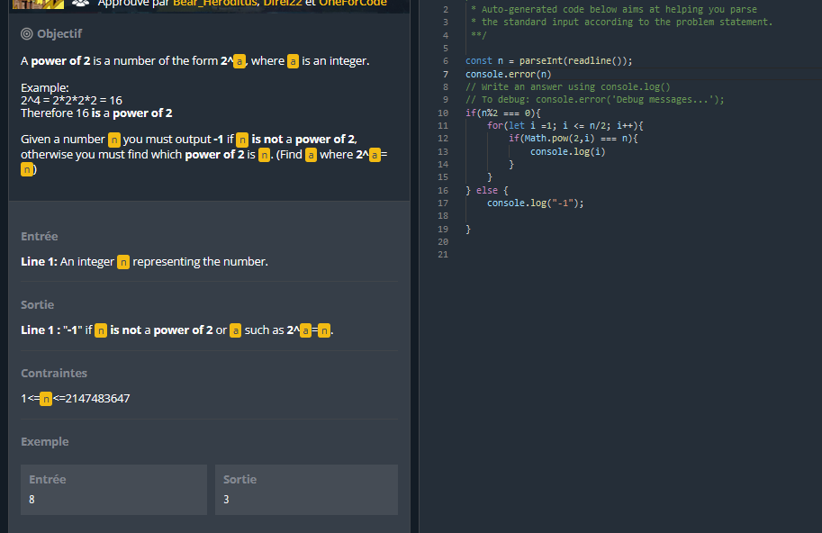

# algorithms
Some training for algorithms, all algorithms are described in the readme of each submodule.

Algorithms come from various sources :
* [CodingGames puzzles](https://www.codingame.com/training)
* [Codility Lessons, exerises and challenges](https://app.codility.com/programmers/)
* [Project Euler archives](https://projecteuler.net/archives)
* Various other exercises

Uses : 

* Java JDK 17
* Scala 3.2.2
* Rust 1.68
* Whatever NPM version was LTS in 2024

Build and run test with a 

> mvn clean package

Command embedded in Intellij Ultimate

# Clashes

 / JS

Unsolved

